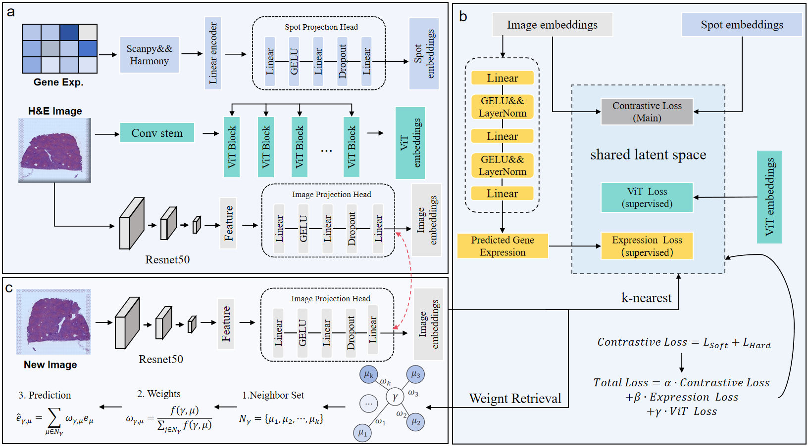

# MViTGene
A cross-modal contrastive learning gene prediction model guided by expression prediction based on spatial transcriptomics
## 🧬 Introduction

This project proposes MViTGene, a cross-modal contrastive learning model for spatial transcriptomics.  The model takes tissue section images and gene expression matrices as inputs, constructing a shared representation space between the two modalities through contrastive learning.  Building upon this foundation, we further incorporate a gene expression-based regression loss as a weakly supervised signal, enabling the model to maintain modal alignment capabilities while acquiring expression prediction capabilities.  Compared to traditional methods relying solely on image features or expression features, MViTGene better integrates spatial morphological information with molecular expression data.

Experimental results demonstrate that MViTGene achieves significantly superior performance to existing methods on the public liver spatial transcriptomics dataset (GSE240429). MViTGene particularly excels at capturing the spatial expression patterns of key functional genes (e.g., CYP3A4), achieving an average improvement of approximately 15%–30% in overall prediction correlation.  This fully validates the model's effectiveness and generalization capability in spatial expression prediction tasks.  Additionally, MViTGene demonstrates strong biological interpretability, enabling the model to identify spatially heterogeneous distribution patterns of metabolism-related and immune-related genes in the liver.

## 📊 Datasets

We used one publicly available spatial transcriptomics dataset in this study.  
You can access it from the NCBI GEO database:

- [GEO Data Portal](https://www.ncbi.nlm.nih.gov/geo/query/acc.cgi)

This dataset includes tissue section images, spatial coordinate files, and gene expression matrices that can be used for preprocessing and model training.

_This part is still under update._
